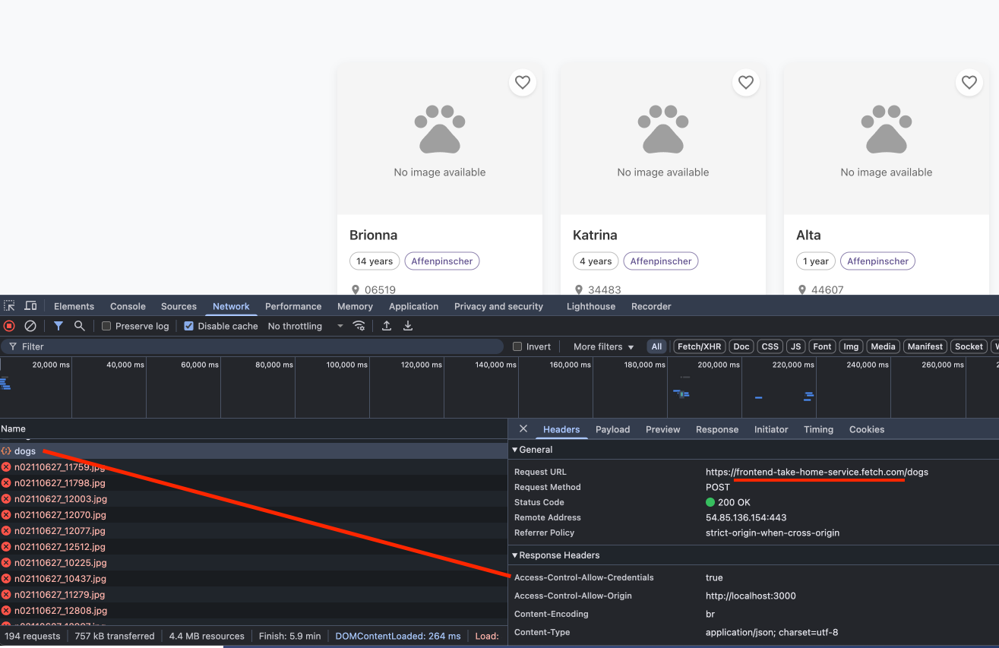
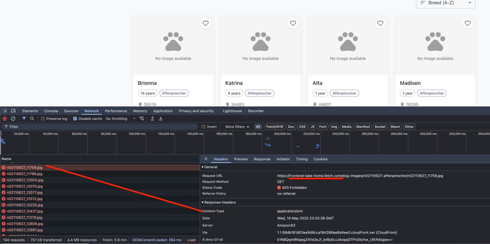

# Fetch Dog Shelter

A React application for browsing and finding shelter dogs, developed for the Fetch Frontend Take-Home Exercise.

## Live Demo

The application is deployed and available at [fetchrewards-dog-shelter.netlify.app](https://fetchrewards-dog-shelter.netlify.app)

## Getting Started

### Prerequisites

- Node.js (v18.0.0 or higher recommended)
- npm or yarn

### Installation

1. Clone the repository
   ```
   git clone https://github.com/Rakesh-Singh-6789/fetch-fe-dog-shelter.git
   cd fetch-dog-shelter
   ```

2. Install dependencies
   ```
   npm install
   ```

3. Start the development server
   ```
   npm start
   ```

4. Open [http://localhost:3000](http://localhost:3000) to view the app in your browser

## Features

1. **User Authentication** - Simple login and logout with name and email
2. **Dog Search** - Browse available dogs with pagination and search functionality
3. **Advanced Filtering** - Filter dogs by:
   - Multiple breeds (select from complete breed list)
   - Age range (minimum and maximum)
   - Location (search by ZIP codes)
4. **Sorting Options** - Sort results by:
   - Breed (A-Z or Z-A)
   - Name (A-Z or Z-A)
   - Age (youngest or oldest first)
5. **Favorites Management** - Add/remove dogs to your favorites list with persistent storage
6. **Dog Matching Algorithm** - Generate your perfect match based on your favorited dogs
7. **Location-Based Search** - Dedicated page for searching and selecting locations by:
   - States
   - Cities
   - ZIP codes
   - Geographical areas
8. **Responsive Design** - Beautiful UI that works on both desktop and mobile devices
9. **Image Handling** - Graceful fallback for images with loading errors
10. **Detailed Dog View** - Modal with detailed information about each dog
11. **Card-Based Interface** - Easy-to-scan cards showing key dog information
12. **Premium UI Elements** - Sophisticated animations, transitions, and visual feedback

## Technologies Used

- React
- TypeScript
- Material UI
- React Router
- Axios for API calls

## Code Quality Highlights

- **Clean, Modular Architecture** - Components, services, and utilities are organized into logical directories
- **Component Reusability** - UI components designed to be reusable across different parts of the application
- **Custom Hooks** - Separation of data fetching and UI logic into custom hooks (e.g., `useDogSearch`)
- **Context-based State Management** - Centralized application state for authentication, favorites, and filters
- **TypeScript Interfaces** - Strong typing enforced throughout the codebase
- **Optimized Bundle Size** - Unused dependencies and imports removed to improve performance
- **Consistent Patterns** - Consistent coding patterns and naming conventions

## API

This project uses the Fetch API service at `https://frontend-take-home-service.fetch.com`.

The following endpoints are used:
- `/auth/login` - User authentication
- `/auth/logout` - User logout
- `/dogs/breeds` - Get list of all dog breeds
- `/dogs/search` - Search for dogs with filtering
- `/dogs` - Get details for specific dogs
- `/dogs/match` - Generate a match based on favorite dogs

### Known Issue: CORS Restrictions

1. The dog images are hosted on a different domain than the API service:
   - Authorized domain: `frontend-take-home-service.fetch.com`
   - Image resource domain: `frontend-take-home.fetch.com`
2. Cross-Origin Resource Sharing (CORS) restrictions prevent direct loading of these images in the browser
3. The browser's security policies block loading resources from a different origin without proper CORS headers

For this demo application, shown an error img to handle these CORS restrictions.

#### CORS Error Screenshots

Below are screenshots demonstrating the CORS errors encountered when attempting to load dog images directly:
*Screenshot 1: Browser console showing the success with domain frontend-take-home-service.fetch.com*

-
-
*Screenshot 2:  Browser console 403 CORS with domain frontend-take-home.fetch.com*



## Project Structure

- `/src/components` - Reusable UI components
  - `DogCard.tsx` - Card component for displaying individual dog information
  - `FavoritesSidebar.tsx` - Sidebar for managing favorites
  - `MatchResult.tsx` - Component for displaying match results
  - `/modals` - Modal components for various interactions
  - `/layout` - Layout components
    - `AppHeader.tsx` - Application header with navigation
  - `/routing` - Routing-related components
    - `ProtectedRoute.tsx` - Route protection for authenticated routes
  - `/ui` - Reusable UI elements
    - `DogCardSkeleton.tsx` - Loading state skeleton for dog cards
    - `EmptyState.tsx` - Empty state display for no search results
  - `/search` - Search-related components
    - `SortControl.tsx` - Dropdown for sorting options
    - `SearchPageHeader.tsx` - Page header with filter and favorites controls
    - `SearchNotifications.tsx` - Error and filter notification alerts
    - `ActiveFilters.tsx` - Display for active search filters
    - `FilterMenu.tsx` - Filter menu popover
- `/src/pages` - Page components
  - `LoginPage.tsx` - User authentication page
  - `SearchPage.tsx` - Main search interface with filters and results
  - `LocationSearchPage.tsx` - Dedicated page for location-based search
- `/src/services` - API services
  - Contains API integration with Fetch's dog shelter service
- `/src/context` - React context providers
  - `AuthContext.tsx` - Authentication state management
  - `FavoritesContext.tsx` - Favorites state management
  - `FiltersContext.tsx` - Filter state management across the application
- `/src/theme` - Theme configuration
  - `theme.ts` - Material UI theme customization
- `/src/types` - TypeScript type definitions
  - Type interfaces for dogs, search parameters, and other data structures
- `/src/utils` - Utility functions
  - `favicon.ts` - Document metadata setup
- `/src/hooks` - Custom React hooks
  - `useDogSearch.ts` - Encapsulated search logic and state management

## Code Organization Principles

The project follows these key principles:

1. **Separation of Concerns** - UI components are separate from business logic
2. **Single Responsibility** - Each component has a clear, focused purpose
3. **DRY (Don't Repeat Yourself)** - Common functionality is extracted into reusable components and hooks
4. **Predictable State Management** - Context API is used for state that needs to be shared across components
5. **Progressive Enhancement** - Core functionality works with graceful fallbacks
6. **Performance Optimization** - Unnecessary re-renders are minimized through proper state management


